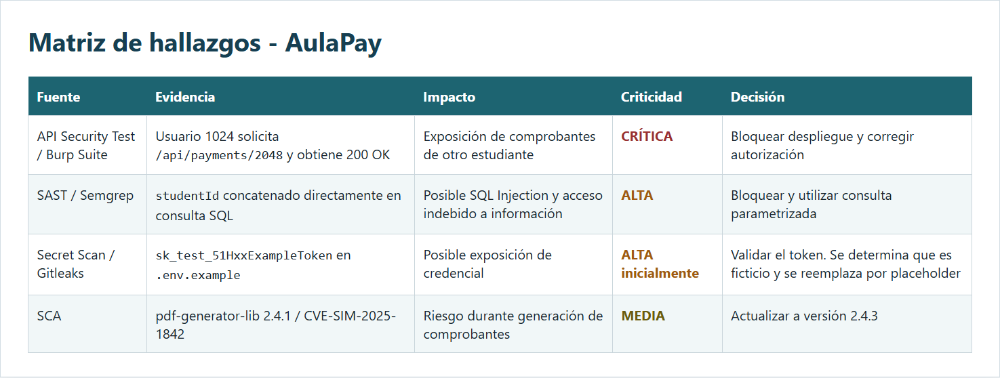
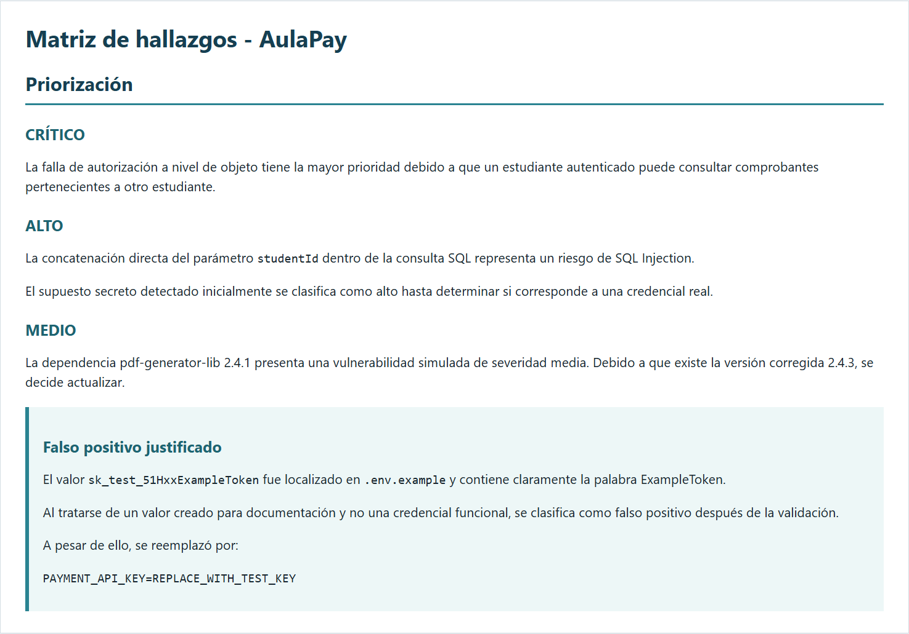
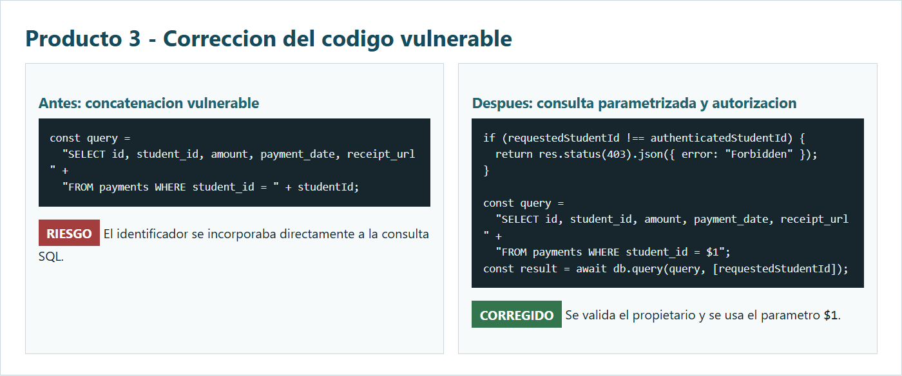
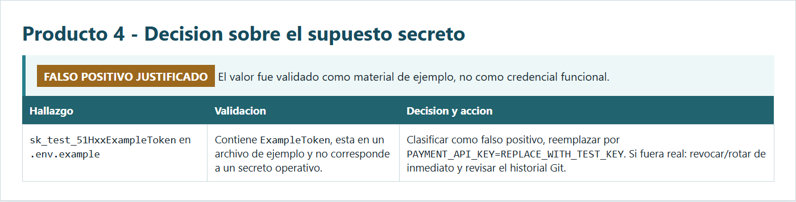
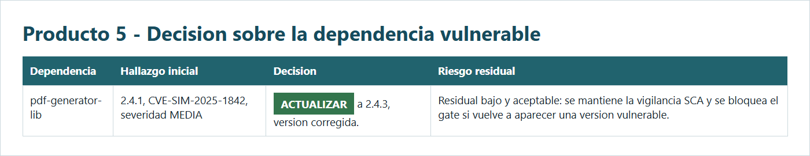
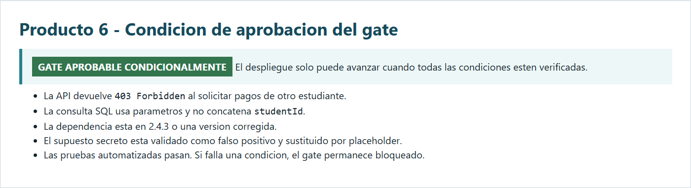
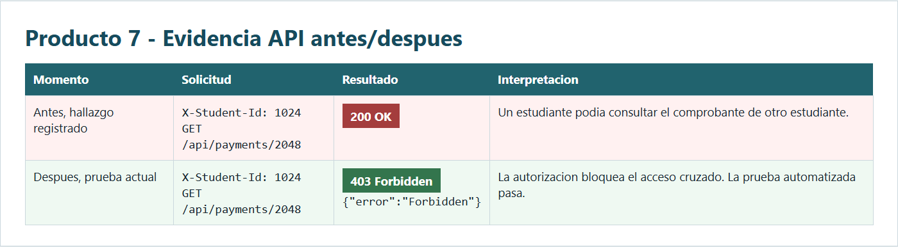

\# Decisión del Gate DevSecOps


\## Estado inicial


\*\*GATE RECHAZADO\*\*


El despliegue no puede avanzar debido a dos condiciones principales:


1\. El usuario autenticado studentId=1024 puede acceder al recurso de studentId=2048 obteniendo HTTP 200 OK.

2\. El código concatena directamente studentId dentro de una consulta SQL.


También se encontraron:


\- Un supuesto token en .env.example que requiere validación.

\- Una dependencia simulada pdf-generator-lib 2.4.1 con vulnerabilidad de severidad MEDIA.


\## Evidencias de la matriz





## Evidencias de los productos 3 a 7

### Producto 3 - Correccion del codigo vulnerable



### Producto 4 - Decision sobre el supuesto secreto



### Producto 5 - Decision sobre la dependencia vulnerable



### Producto 6 - Condicion de aprobacion del gate



### Producto 7 - Evidencia API antes y despues



\## Correcciones aplicadas


\### SQL Injection


Antes:


```javascript

const query =

&#x20; "SELECT id, student\_id, amount, payment\_date, receipt\_url " +

&#x20; "FROM payments WHERE student\_id = " + studentId;

